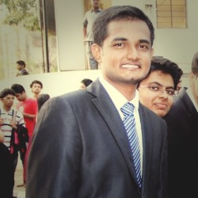

## About Me

Hello, I am a masters student in Computer engineering department(https://www.ece.ubc.ca/) of The University of British Columbia(https://www.ubc.ca/), Vancouver, Canada.
I work as a research assistant in The Reliable, Secure, and Sustainable Software Lab(http://www.ece.ubc.ca/~mjulia/ReSeSS.html) with Dr. Julia Rubin(http://www.ece.ubc.ca/~mjulia/index.html) on topics like Distributed systems, Cloud-native archtectures(Microservices) and Android kernel.

## Research Interest

I spend most of my 

## Publications

1. F.Bar, J.Doe: Effects of having a placeholder of a name
2. S.Holmes, J.Watson: Consequences of living with a sociopath in London

## Typography

This is a [link](http://google.com). Something *italics* and something **bold**.

Here is a table

Year | Award | Category
-----|-------|--------
2014 | Emmy  | Won Outstanding Lead Actor in a miniseries or a movie
2015 | BAFTA | Nominated for Best Leading Actor for Sherlock
2014 | Satellite | Won Best Actor miniseries or television film

Here is a horizontal rule

---

Here is a blockquote

> To a great mind, nothing is little

## References

* Foo Bar: Head of Department, Placeholder Names, Lorem
* John Doe: Associate Professor, Department of Computer Science, Ipsum
